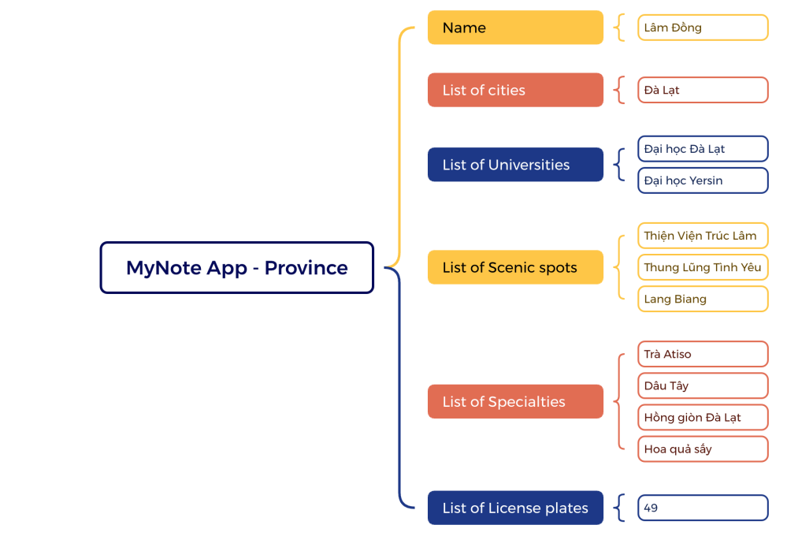

This image is a screenshot of the MyNote app that provides information on cities,
universities, specialties, and license plates

Here's how CRUD can be applied to province information management in a mobile app:
Allow users with appropriate permissions to add new provinces. This might involve
inputting fields like:
- Province Name
- City
- License plate
- University (optional)
- Scenic spot (optional)
- Specialty ((optional)
Display a list of all provinces. This list could be:
- Searchable by name
- Sortable by name
- Each province entry clickable, leading to a detailed view
- Detailed view of a specific province: Show all information associated with the province
Allow authorized users to edit existing province information. This could involve:
- Selecting a province from the list or detailed view
- Editing relevant fields (name, city, license plate, university, scenic spot and specialty)
- Saving the changes to update the province information
Allow authorized users to remove provinces (with confirmation prompts).
Additional Considerations:
- Data Validation: Ensure data entered for new provinces is valid (e.g., name not empty
and not duplicate, city not empty and license plate a number).
- Google Sign (Optional)
